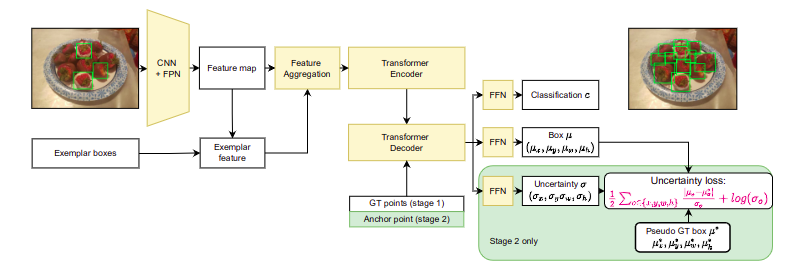
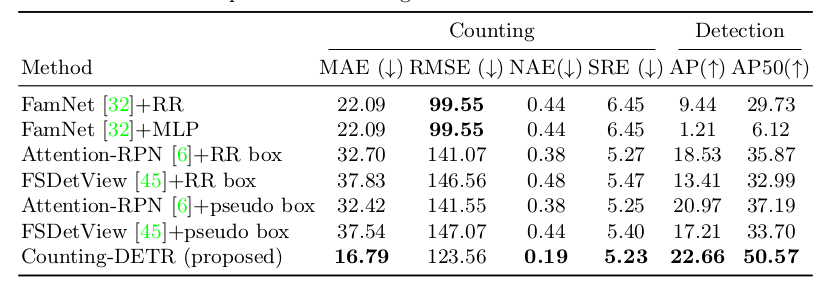
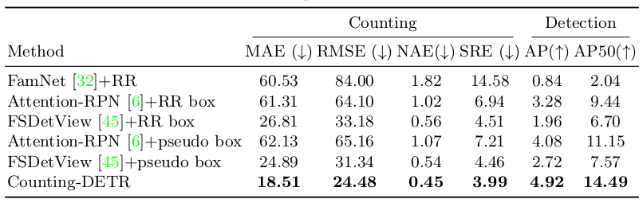

**Counting-DETR**: Few-shot Object Counting and Detection
========
##### Table of contents
1. [Introduction](#Introduction)
2. [Main Results](#Main-Results)
3. [Usage](#Usage) 
4. [Acknowledgments](#Acknowledgments)
5. [Contacts](#Contacts)


## Introduction
> **Abstract**: 
We tackle a new task of few-shot object counting and detection. Given a few exemplar bounding boxes of a target object class, we seek to count and detect all objects of the target class. This task shares the same supervision as the few-shot object counting but additionally outputs the object bounding boxes along with the total object count. 
To address this challenging problem, we introduce a novel two-stage training strategy and a novel uncertainty-aware few-shot object detector: \Approach. The former is aimed at generating pseudo ground-truth bounding boxes to train the latter. The latter leverages the pseudo ground-truth provided by the former but takes the necessary steps to account for the imperfection of pseudo ground-truth. 
To validate the performance of our method on the new task, we introduce two new datasets named FSCD-147 and FSCD-LVIS. Both datasets contain images with complex scenes, multiple object classes per image, and a huge variation in object shapes, sizes, and appearance. Our proposed approach outperforms very strong baselines adapted from few-shot object counting and few-shot object detection with a large margin in both counting and detection metrics.




Details of the Counting-DETR model architecture and experimental results can be found in our following paper: [Counting-DETR](https://arxiv.org/abs/2207.10988)

```
@inproceedings{countingdetr2022,
title     = {{Few-shot Object Counting and Detection}},
author    = {Thanh Nguyen, Chau Pham, Khoi Nguyen and Minh Hoai},
booktitle = {Proceedings of the European Conference on Computer Vision 2022},
year      = {2022}
}
```
Please CITE our paper when Counting-DETR is used to help produce published results or incorporated into other software.

## Main Results

For experiments on the FSCD-147 dataset



For experiments on the FSCD-LVIS dataset




## Usage

### Installation
First, pull the docker with the following command:
```
docker pull quaden/docker_images:pytorch_cuda102
```

Second, create a container
```
docker run -it  --name od_cnt --gpus=all  --shm-size=8G --volume="$PWD:/workspace/" --ipc=host -v /tmp/.X11-unix:/tmp/.X11-unix -e DISPLAY=$DISPLAY  pytorch_cuda102:latest  /bin/bash
```


### Training and Testing

First, clone this git repo inside the docker container
```
git clone git@github.com:VinAIResearch/Counting-DETR.git
```
Second, download the dataset and unzip it to each folder from the below link inside the docker container:
```
https://drive.google.com/drive/folders/14qzZaV4S8EBUj3yEkgrDQC7iErHxSPjl?usp=sharing
```

Then, change the directory to the corresponding experiments and run the corresponding scripts. 
Sample scripts would both train and evaluate experiments.

For the 1st stage in FSCD-147 experiments:
```
cd src/CountDETR_147_1st_stage && ./scripts/weakly_supervise_fscd_147.sh
```

For the 2st stage in FSCD-147 experiments:
```
cd src/CountDETR_147_1st_stage && ./scripts/var_wh_laplace_600.sh
```

For the 1st stage in FSCD-LVIS experiments:
```
cd src/CountDETR_lvis_1st_stage && ./scripts/weakly_supervise_fscd_147.sh
```

For the 2st stage in FSCD-LVIS experiments:
```
cd src/CountDETR_lvis_2nd_stage && ./scripts/var_wh_laplace_lvis_2nd.sh
```

## Acknowledgments
Our code borrowed some parts of the official repositories of AnchorDETR.
Thank you so much to the authors for their efforts to release source code and pre-trained weights.

## Contact
If you have any questions, feel free to open an issue or contact us at NguyenVanThanhHust@gmail.com.
